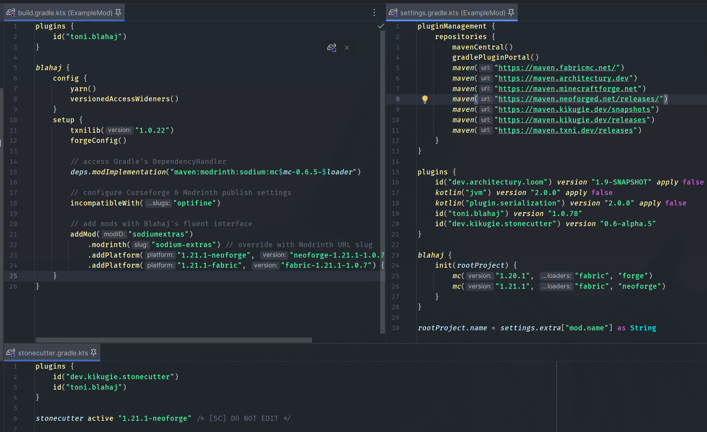
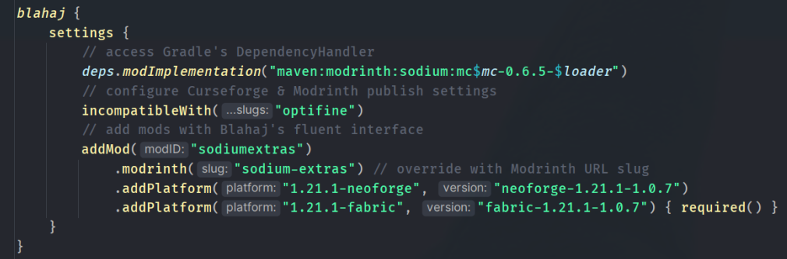

# Introduction to Blahaj

Blahaj provides a fully automated mod dev experience for multiversion modding. Almost everything is handled behind the 
scenes in the plugin, including Loom setup, registering tasks and build settings, and adding default dependencies. 

However, you still need to write multiversion code--so if you are not already familiar with both
Forge & Fabric toolchains, events, APIs, etc, it will likely still require extra effort compared to regular single-version modding.

Most typical project setup tasks are simply just adding dependencies to your project though, so ideally, Blahaj should handle 
everything else in one place, removing the need for managing dozens of build scripts for all your mods. 
The plugin is built with this in mind, so the three Gradle script files Blahaj uses are made as short as possible:
- `settings.gradle.kts`, which loads first and defines some of the required plugins, and initializes Blahaj. 
You'll only need to touch this if you bump plugin versions or add new Minecraft versions in Blahaj setup.
- `stonecutter.gradle.kts`, which is the root project controller, which you don't have to touch at all. 
- `build.gradle.kts`, which is the main file you'll configure everything in.

Most of what you will need to do can be done from Blahaj's settings block, where you can add multiversion mods using 
the `addMod()` fluent API, configure settings, and access the Gradle `dependency` context directly. 

For example, this script here adds Sodium directly with Gradle `deps` (there is a helper method for this though) 
using `$mc` and `loader` injections in the string template, makes the mod on Curseforge/Modrinth as incompatible with Optifine,
and uses `addMod("sodiumextras")` to add that mod as a dependency.

In the `BlahajDependency` chain, you must define a binding for it to pull the mod from, and version numbers for each platform, so it can
invoke the binding for each applicable project and fetch the mod. In the example above, Sodium Extras is being pulled from Modrinth (with a custom
slug, because it doesn't match the mod ID) and then being configured with a unique version number for each platform. You can also pass a callback,
which is only invoked on the matching platform--in this case, used to mark it as required only on Fabric.

If you want to customize the underlying build process, you can still do so using regular Gradle project utilities, but you may be a little more 
restricted by the streamlined experience. Blahaj tries to provide options and toggles for most things. If you need something tweaked, you
can submit a PR, or you can always [contact me on Discord](https://discord.gg/kS7auUeYmc) at `toni.toni.chopper` for questions and help setting things up.

## What's in Blahaj?

The [default template](https://github.com/txnimc/TxniTemplate) is set up with the following:

- Fabric, Forge, and NeoForge in one sourceset, using Stonecutter + Manifold preprocessor
- Preconfigured support for all modern 'LTS' versions, in one sourceset (1.20.1, 1.21 by default, other versions can be added)
- Mojang Mappings with Parchment
- Mixins for all platforms
- Automatic dependency injection into `fabric.mods.json`, `mods.toml`, and Curseforge/Modrinth release dependencies.
- Access Wideners (automatically converted to Forge Access Transformers)
- GitHub Actions workflows to automatically deploy published jars

## Helper Tasks

Additionally, Blahaj provides some helper tasks for automating common mod dev things:

- `renameExampleMod`, which you can run once after forking the template and editing gradle.properties to instantly get started.
- `bumpVersionAndChangelog`, which will ask you for a version type (major, minor, patch) and changelog, bump the gradle.properties, and automatically append CHANGELOG.md
- `copyToModrinthLauncher`, which will run a chiseled buildAll and copy the files to designated Modrinth App profiles for testing ([more on that here](/modrinthdebugging))
- `publishAllRelease`, a standard mod-publish task, which will automatically publish all versions to Modrinth and Curseforge.
- `publishAllMaven`, which does the same automated publishing of all versions, but for your own Maven. I recommend [Reposilite.](https://reposilite.com/)

## Optional Features

Blahaj provides full opt-in support for the following, each activated with one line in Gradle setup:

- TxniLib, which provides runtime multiversion abstractions
- Cross-platform Forge Config (FC API Port)
- Yarn mappings (smh)
- Version specific or platform specific Access Wideners
- Version specific or platform specific Mixin configs
- Sodium and Iris in your dev instance
- EMI in your dev instance