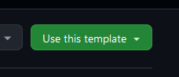
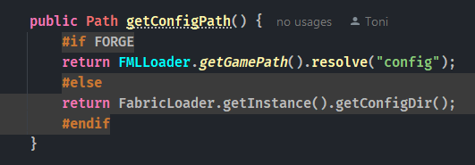

# Getting Started Using Blahaj

The easiest way to use Blahaj is just to [fork my template mod](https://github.com/txnimc/TxniTemplate), which is set up
with everything you need to use it.

This template is specifically built for the community! I want to encourage more people
to build mods this way, because it's better for everyone if projects are built with wide loader and version support from the start.

It is MIT licensed and allows anyone to fork and relicense, and it's easy to do so
if you click the "Use this template" button in the top right corner:



You can also depend on my personal library, TxniLib, which contains some multiloader/multiversion
abstractions that I find helpful. I do my best to document it, though it isn't a top priority.

With that said, I hope this readme covers most of the things you will need to know, but you can always [contact me on Discord](https://discord.gg/kS7auUeYmc)
at `toni.toni.chopper` for questions and help setting things up.

## Configuring Gradle

The very first thing you're going to want to do after forking and importing the Gradle project is rename the template.
There is a built in helper task for this: `renameExampleProject`, which will use the following values from
your `gradle.properties` file. Make sure you set all of them, they are used elsewhere!

::: code-group
```md [gradle.properties]
# ----------Mod Properties----------#
# Make sure you edit these before running renameExampleMod!
mod.version=1.0.0
mod.license=ARR
# Root Folder Path (/java/group/namespace/)
mod.group=toni
mod.namespace=examplemod
# Mod ID and Main Class Name
mod.id=example_mod
mod.name=ExampleMod
# English Display Info
mod.author=Toni
mod.github=anthxnymc
mod.display_name=Example Mod
mod.description=Yet Another Example Mod
# ----------------------------------#
```

You'll also of course want to set the Curseforge and Modrinth deployment IDs, but that isn't necessary right away. 
Just set the above values, run the `renameExampleProject` Gradle task, and you're good to go!

## Using Stonecutter

You will only get IntelliSense for one version at a time, but this can be changed by using the `Set active project to version-loader` 
gradle helper tasks under the `stonecutter` folder in the root project.


## Versioned Dependencies

The main difference from an typical setup is that the main `build.gradle.kts` Gradle script handles both Fabric
and Forge builds for every game version. This is one of the main hurdles of multiversion---managing dependencies for every
target in one script.

Because of this, you will need to ensure that your Gradle scripts are written to use the mod and version data attached to the `BlahajSettings` 
controller, such as `mod.isFabric` or the `mc` and `loader` strings.

Stonecutter also provides a simple way to create versioned `gradle.properties`, which is actually where the Loom platform is configured.
In the root project's `gradle.properties`, set any property you want to be versioned to `[VERSIONED]`:

::: code-group
```md [gradle.properties]
# ----------Dependencies------------#
deps.fapi=[VERSIONED]
# ----------------------------------#
```
:::

Most of the built-in Blahaj versions, for things like Fabric API version and Forge loader version, can be overridden by setting these versioned
properties in the `versions/gradle.properties` files.

::: code-group
```md [versions/1.20.1-fabric/gradle.properties]
loom.platform=fabric

# ----------Dependencies------------#
deps.fapi=0.99.4+1.21
# ----------------------------------#
```
:::


## Using Manifold To Implement Version-Specific Code

You're going to need to download the [**Manifold IntelliJ plugin**](https://plugins.jetbrains.com/plugin/10057-manifold), as it is required for highlighting to
work on the Manifold preprocessor directives ([more on IntelliJ config here](/intellij)). 

<sub>*If you're not using IntelliJ, you're using the wrong editor and are on your own :3*</sub>

This essentially replaces the patterns of the default [Stonecutter preprocessor](https://stonecutter.kikugie.dev/stonecutter/comments), 
which you are still free to use if you wish. Manifold being an actual compiler plugin has a number of advantages, including inline
preprocessor directives, easier editing, and the most important part---not having to mutate the source files
when changing the main project version.

The Manifold scripts will generate **FABRIC** and **FORGE** markers for separating loader-specific code.
Also, for each Minecraft version, five markers are created, using the minor and patch versions of the mcVersionStr:
- **BEFORE_20_1** (exclusive, <)
- **UPTO_20_1** (inclusive, <=)
- **NEWER_THAN_20_1** (exclusive, >)
- **AFTER_20_1** (inclusive, >=)
- **CURRENT_20_1**, ==, a standalone marker that will single out that version.

You can use `#IF` blocks to separate code between modloaders and game versions.



For example, lets say a breaking change was introduced in 1.20.1. You could use `#IF BEFORE_20_1` for all code
without the change, and `#IF AFTER_20_1` for all code including the change.

This template still uses the structure and per-version specific files of the ReplayMod preprocessor, so if you need to
override a file for a specific version, you can do so by putting it in the `versions/` folder under the same path as the original.
